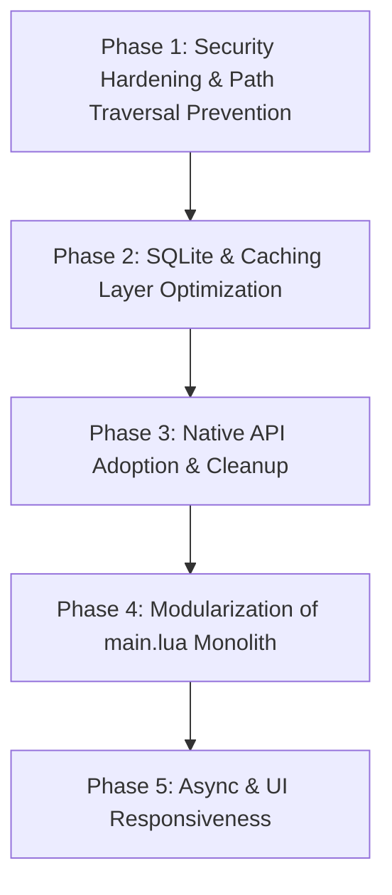

# App Store KOPlugin - Architectural Improvement Plan & Task List

Repository: `https://github.com/fusuyfusuy/appstore.koplugin`  
Target Version: v2.0 Refactor Roadmap  

---

## Overview

This document outlines the comprehensive refactoring, security hardening, performance optimization, and modularization roadmap for the KOReader App Store Plugin (`appstore.koplugin`).

The plan is divided into 5 distinct execution phases ordered by priority: security critical fixes first, followed by data layer stability, native API consolidation, structural modularization of the 9,300-line `main.lua` monolith, and UI/UX asynchronous responsiveness.

---

## Roadmap & Implementation Phases

---

### Phase 1: Security Hardening & Path Traversal Prevention

#### 1.1 Zip Slip Vulnerability Mitigation
- **Context**: Unzipping remote release archives or plugin packages must validate extracted target paths.
- **Specification**:
  - Resolve canonical paths before extraction using path normalization (`ffiUtil.realpath` or string normalization).
  - Verify `target_path:startswith(destination_dir)`. Reject and log any entry resolving outside `destination_dir` (e.g., `../../...`).
  - Sanitize entry filenames to prevent absolute path overrides.

#### 1.2 GetText Localized Chunk Sandboxing (`appstore_gettext.lua`)
- **Context**: `loadLangTable` loads dynamically named locale files from `l10n/<code>.lua` using `loadfile`.
- **Specification**:
  - Validate `lang` / `code` parameter format with strict whitelist pattern `^[a-zA-Z0-9_-]+$`. Reject any parameter containing directory separators or special characters.
  - Sandbox chunk execution environment using `setfenv` (LuaJIT) with a restricted table (`{}`) to prevent untrusted code execution during translation evaluation.

---

### Phase 2: SQLite & Caching Layer Optimization

#### 2.1 Persistent Database Handle & Lifecycle Management (`appstore_cache.lua`)
- **Context**: `withConnection` opens (`SQ3.open`) and closes (`conn:close`) SQLite database handles on every single read/write query, causing severe I/O overhead on e-ink flash storage.
- **Specification**:
  - Maintain a singleton, persistent SQLite database connection initialized on plugin load and closed on plugin exit.
  - Implement statement caching for frequent operations (`storePatchFiles`, `queryRepos`, `getRepo`).

#### 2.2 Schema Versioning & Clean Migration System
- **Context**: Table creation statements use `CREATE TABLE IF NOT EXISTS` without incremental schema version tracking.
- **Specification**:
  - Add `user_version` PRAGMA checking and explicit version migration handlers (`migrate_v1_to_v2`, etc.).
  - Ensure transactions (`BEGIN IMMEDIATE` / `COMMIT`) wrap schema updates and bulk cache writes.

#### 2.3 Query Performance & Indexing Optimization
- **Context**: Catalog filtering and star sorting require optimized queries to maintain UI responsiveness.
- **Specification**:
  - Verify multi-column indexes (`idx_repos_kind_stars`, `idx_patch_files_repo`).
  - Optimize string search queries to avoid unindexed full table scans where possible.

---

### Phase 3: Native API Adoption & Cleanup

#### 3.1 Standardize Directory Cleanup with `util.purgeDir`
- **Context**: `main.lua` (lines 557-583, 8444-8450) re-implements custom recursive directory traversal and deletion via `lfs.dir` and `lfs.rmdir`.
- **Specification**:
  - Replace custom recursive deletion functions with KOReader's built-in `util.purgeDir(path)` API.
  - Consolidate directory verification and creation utilizing `util.makePath` and `ffiUtil.joinPath`.

#### 3.2 Code Duplication Elimination
- **Context**: Duplicate helper functions exist in `main.lua` (e.g., `buildPatchRepoDescriptor` defined at line 204 and line 481).
- **Specification**:
  - Audit and consolidate duplicated utility functions into shared helpers or dedicated helper modules.
  - Eliminate redundant filesystem attribute calls by caching file metadata during catalog scanning operations.

---

### Phase 4: Modularization of `main.lua` Monolith

#### 4.1 Architectural Decomposition
- **Context**: `main.lua` is ~9,300 lines (~340 KB), mixing UI dialogs, network fetching, installation logic, version comparison, and menu registration.
- **Specification**: Split `main.lua` into focused modules:

| Module | Location | Target Responsibility |
| :--- | :--- | :--- |
| **Installer Module** | `appstore_installer.lua` | Package download, extract, installation, patch injection, uninstall, rollback |
| **Browser UI Module** | `appstore_browser_ui.lua` | App store catalog browsing, search dialogs, details view, repository sorting |
| **Manage UI Module** | `appstore_manage_ui.lua` | Installed plugins/patches management list, update triggers, enable/disable toggles |
| **Version Module** | `appstore_version.lua` | Semver parsing, version comparisons, compatibility validation against KOReader core |
| **Main Orchestrator** | `main.lua` | Entry point, plugin lifecycle registration, menu dispatcher (~200 lines) |

---

### Phase 5: Async & UI Responsiveness

#### 5.1 Non-Blocking UI Feedback & Progress Indicators
- **Context**: E-ink displays require clear visual feedback during synchronous network or disk operations to avoid user double-tapping or assuming freeze.
- **Specification**:
  - Wrap network operations and background updates with KOReader `UIManager:nextTick` or `Spinner` / `InfoMessage` widgets.
  - Provide animated progress feedback during zip extraction and package installation steps.

#### 5.2 NetworkMgr Integration & Download Queuing
- **Context**: Network calls should integrate gracefully with KOReader network availability detection.
- **Specification**:
  - Leverage `NetworkMgr:runWhenOnline` prior to initiating catalog downloads or updates.
  - Ensure timeouts and network failure states are caught gracefully and surfaced via non-blocking notifications (`UIManager:show`).

---

## Summary Task Matrix

| Task ID | Task Description | Target File(s) | Priority | Phase |
| :--- | :--- | :--- | :--- | :--- |
| **SEC-01** | Implement Zip Slip path normalization and validation | `main.lua`, `appstore_installer.lua` | High | Phase 1 |
| **SEC-02** | Sanitize locale code input & sandbox `loadfile` in `appstore_gettext.lua` | `appstore_gettext.lua` | High | Phase 1 |
| **DB-01** | Convert SQLite helper to persistent connection lifecycle | `appstore_cache.lua` | High | Phase 2 |
| **DB-02** | Add PRAGMA `user_version` migration system | `appstore_cache.lua` | Medium | Phase 2 |
| **API-01** | Replace custom recursive rmdir with `util.purgeDir` | `main.lua` | Medium | Phase 3 |
| **API-02** | Remove duplicate `buildPatchRepoDescriptor` & clean unused code | `main.lua` | Low | Phase 3 |
| **MOD-01** | Extract `appstore_version.lua` semver logic | `appstore_version.lua`, `main.lua` | Medium | Phase 4 |
| **MOD-02** | Extract `appstore_installer.lua` download & extraction logic | `appstore_installer.lua`, `main.lua` | High | Phase 4 |
| **MOD-03** | Extract `appstore_browser_ui.lua` catalog browsing dialogs | `appstore_browser_ui.lua`, `main.lua` | High | Phase 4 |
| **MOD-04** | Extract `appstore_manage_ui.lua` management UI components | `appstore_manage_ui.lua`, `main.lua` | High | Phase 4 |
| **UI-01** | Add Spinner/InfoMessage indicators for I/O and extraction | `appstore_browser_ui.lua`, `main.lua` | Medium | Phase 5 |
| **UI-02** | Integrate `NetworkMgr:runWhenOnline` for all network requests | `appstore_net_github.lua`, `main.lua` | Medium | Phase 5 |
